Gathering Fields in Marc Records
=====================================================================================================================================

This section will inform users on how to gather the fields and subfields
being used in a MARC record. The report will produce a file with the
following information: the field, the subfield, the number of records
the field (does not apply to subfield) occurs in, and the total number
of occurrences of the field or subfield (this number includes multiples
in a field which are counted by **semicolons**). This file is saved as a
txt file, but formats better if opened with excel or spreadsheet
software.

1.  Open MarcEdit

2.  Click on **MarcEditor**

3.  Click on the **File** Menu

4.  Choose **Open**

> 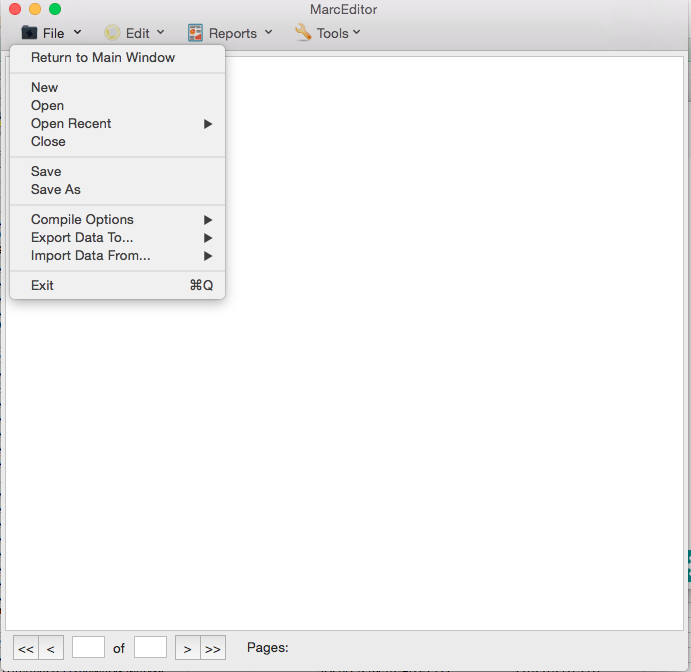

**Steps 3 ,4**

1.  Choose the correct Marc record and **Open**

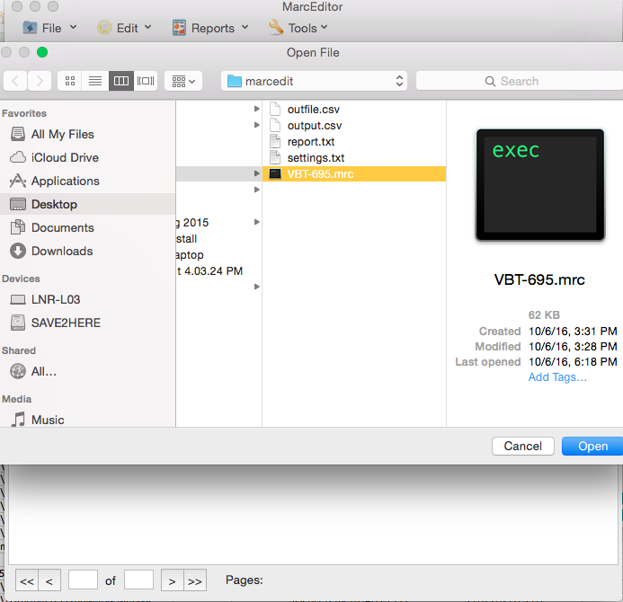

1.  Choose the **Reports** Menu

2.  Choose **Field Count**

> 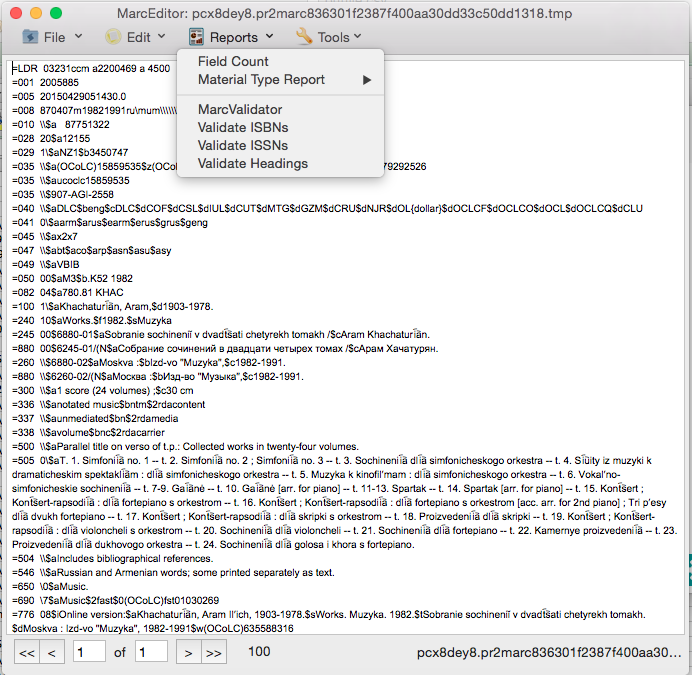

**Steps 6, 7**

1.  Click on **Generate Report**

    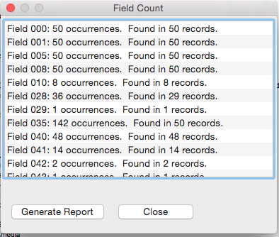

2.  Save to txt file. (Sample seen below)

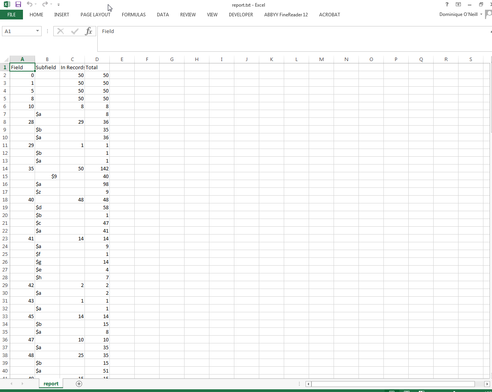
Marc Record to CSV
==================

This section allows for users to convert MARC Records to Delimited
Records (Tab; pipe(|) or comma(,)). The program requires users to enter
the MARC fields they want exported into the CSV file (i.e. 001, 100). In
order to determine what fields are being used in the desired MARC Record
look at the second section titled: [Gathering Fields in Marc
Records](#_Gathering_Fields_in). This will provide the user with a
report of all the MARC fields being used in the MARC record, along with
the how often the field appears in the Record. The user might want to
use this report to compile a list of fields they want ingested. In order
to do this they need to create a plain text (.txt) file with the first
line: **\#NORMAL:\#true** followed by the fields wanted on a new line
(see image to the left).
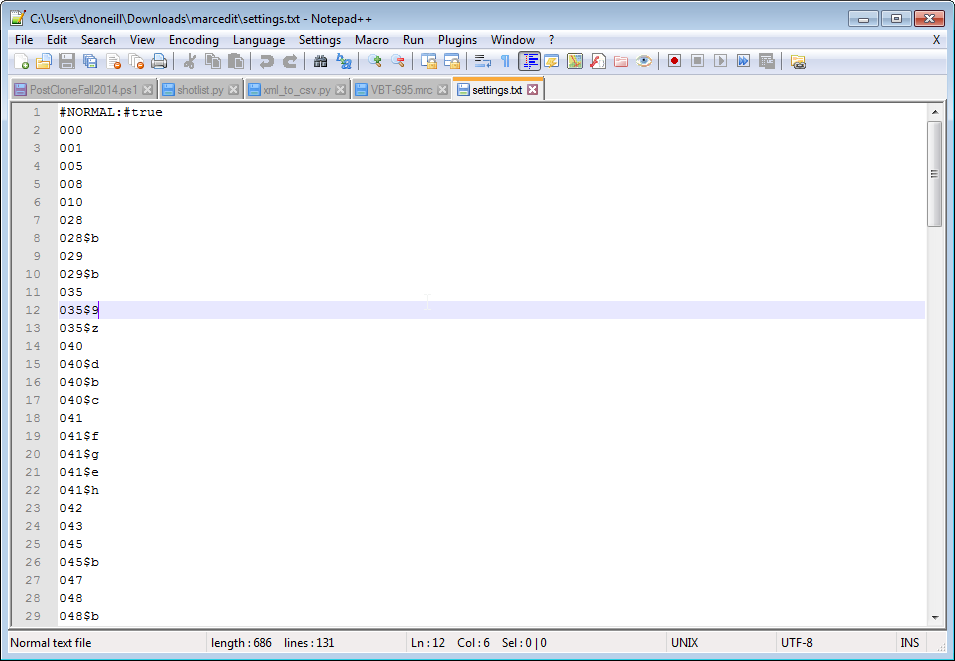

Additionally the
user should be aware that MARC fields without any sub categories are
automatically assumed to be of the subcategory $a. So if you request the
MARC field 100, the program will believe this to be the equivalent to
100$a. This means importing the 100 field and the 100$a field would lead
to redundant information. Step 8a shows users how to import a txt file
with preloaded fields while 8b shows users how to import fields
manually. The screenshots below are from a MacBook, MarcEdit with
another operating system (i.e. Windows) might appear slightly different.

1.  Open MarcEdit

2.  Click on the **Tools** Menu

3.  Choose **Export Records**

4.  Choose Export Tab Delimited Records

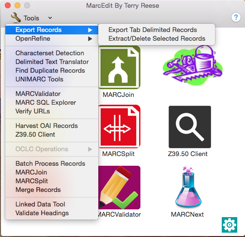

**Steps 2,3,4**

1.  Under the **MARC File:** Enter the file path of the marc record
    (red arrow)

2.  Under **Save File:** Enter the file path and name of the output
    record (blue arrow)

3.  Under **Delimiter** choose desired delimiter (comma, tab, pipe)
    (green arrow)

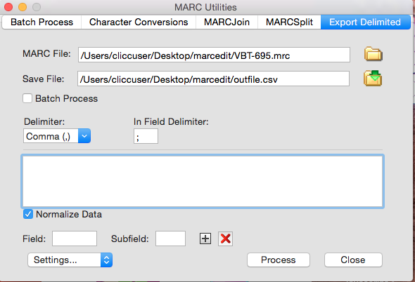

**Steps 5,6,7**

1.  Load Settings (Fields to be exported to csv file). This can be done
    one of two ways:

    1.  Load a txt file that has all of the fields you want exported

        1.  Click **Settings**

1.  Choose settings file you have already created and click open

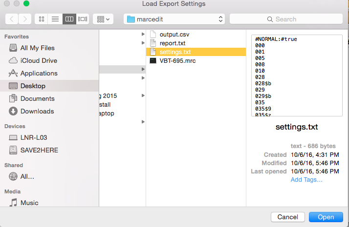

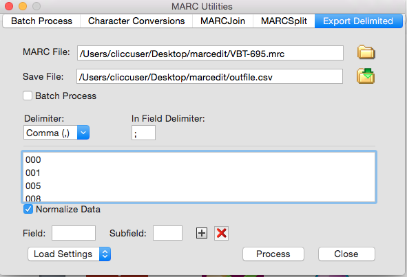

1.  Enter the field and subfield into the **Field** and **Subfield**
    boxes and click on the **+** button. This has to be done for
    each field.

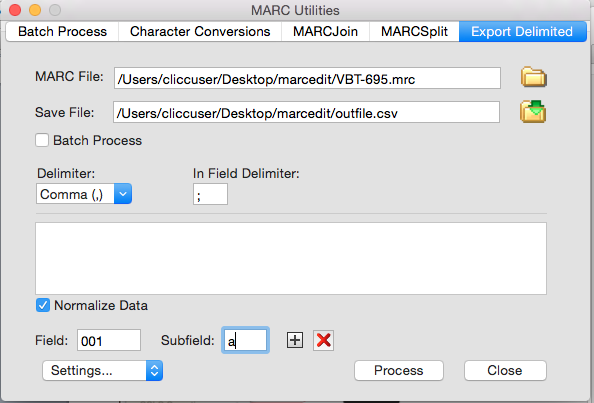

1.  Click **Process**

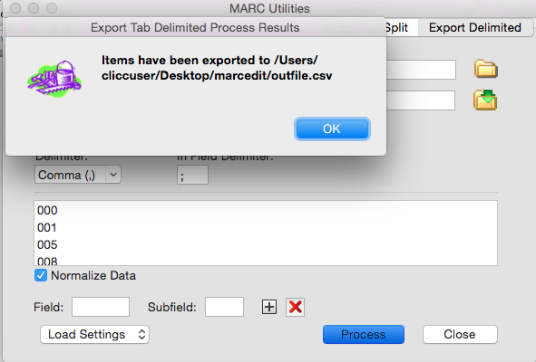

MODS to CSV
===========

MARC is the best form of structured metadata to convert into a csv,
however other formats can be converted. Converting from MODS to CSV is
somewhat circuitous. It requires the user to convert the MODS records
into MARC using MARCEdit’s capabilities. Unfortunately if the MODS
records are in individual files this requires a multi-step process and
often these have to be converted one at a time.

The following section (3.1) shows how to use Batch Edit, however I was
unable to get it to work. I believe the problem has to do with the
encoding of the MODS records I was using. If the user can get batch edit
to work, they should skip to section 3.4 which are the same steps as
Section 1. If you are unable to get Section 3.1 to work you should move
on to 3.2 which shows how to individually convert MODS files. Section
3.3 shows how to combine multiple converted MARC records (from section
3.2) into one MARC record. Section 3.4 shows how to convert a MARC
record into a CSV (Same as Section 1).

Batch Processing MODS to Marc (might not work)
----------------------------------------------

1.  Open Tools &gt; Batch Process
    Records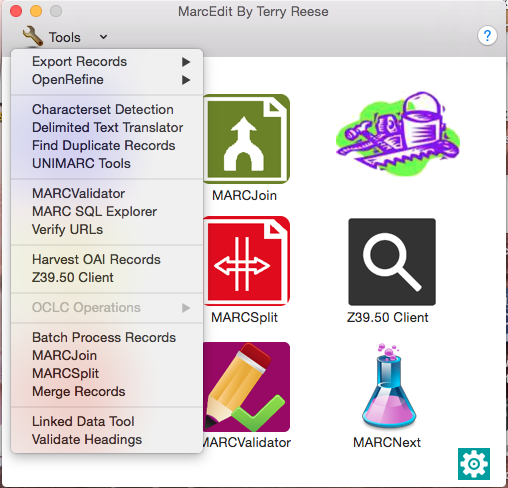

2.  Enter the directory containing the MODS files

3.  Enter the file type of xml

4.  Change the Function to
    **MODS=&gt;MARC**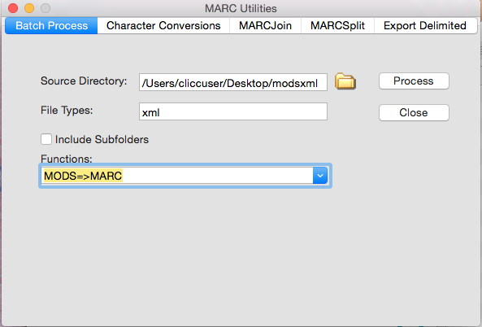

5.  Click **Process**

> 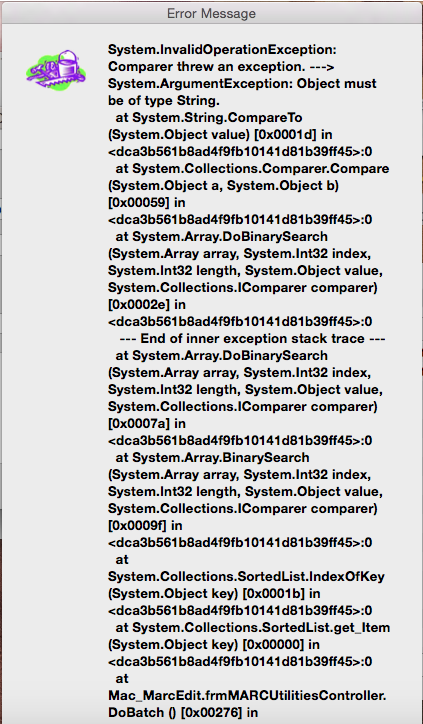

**Error Screen**

Individual Conversion MODS to MARC
----------------------------------

If you run into this error screen from section 3.1, you must convert
these MODS records to MARC individually. Here are the following steps on
how to do so.

1.  Open **MARC Tools**

    

2.  Choose the correct input file (xml)

3.  Enter Save file location. Make sure the extension is **mrc**

4.  Change Function List to **MODS=&gt;MARC**

5.  Change Default Character Encoding to **UTF8**
    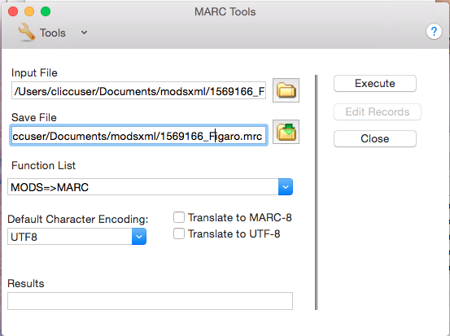

6.  Click **Execute**

7.  Repeat with all MODS files

    1.  Combine Individual Marc Records into One Marc Record
        ----------------------------------------------------

If you were unable to convert MODS to MARC in batch and had to do so
individually perform the following steps to convert the individual files
into one large file. This is necessary if you are going to convert these
records into one CSV file.

1.  Click on **MARCJoin**

> 

1.  Enter the location of the combined file into **Save File**

2.  Click on the folder icon next to **File(s) to Join**

    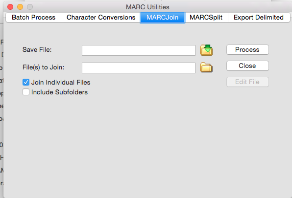

3.  Highlight the files to join

4.  Click **Open**

> 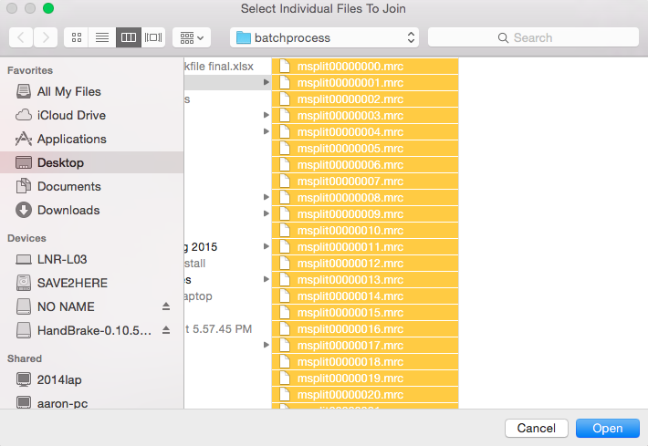

1.  Click **Process**

    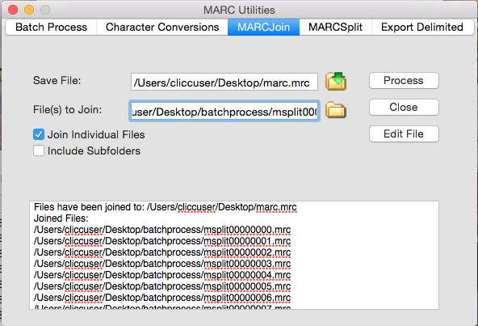

    1.  Convert Combined Marc To CSV (Same as Section 1)
        ------------------------------------------------

<!-- -->

1.  Open MarcEdit

2.  Click on the **Tools** Menu

3.  Choose **Export Records**

4.  Choose Export Tab Delimited Records

    

> **Steps 2,3,4**

1.  Under the **MARC File:** Enter the file path of the marc record
    (red arrow)

2.  Under **Save File:** Enter the file path and name of the output
    record (blue arrow)

3.  Under **Delimiter** choose desired delimiter (comma, tab, pipe)
    (green arrow)

> 
>
> **Steps 5,6,7**

1.  Load Settings (Fields to be exported to csv file). This can be done
    one of two ways:

    1.  Load a txt file that has all of the fields you want exported

        1.  Click **Settings**

> 

1.  Choose settings file you have already created and click open

> 
>
> 

1.  Enter the field and subfield into the **Field** and **Subfield**
    boxes and click on the **+** button. This has to be done for
    each field.

    

<!-- -->

1.  Click **Process**

    

