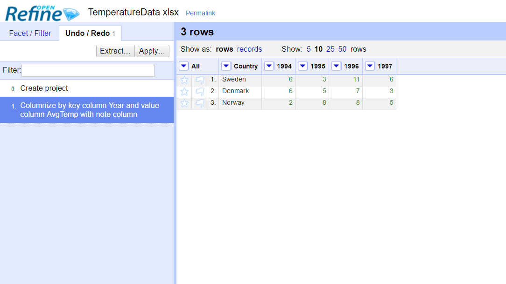
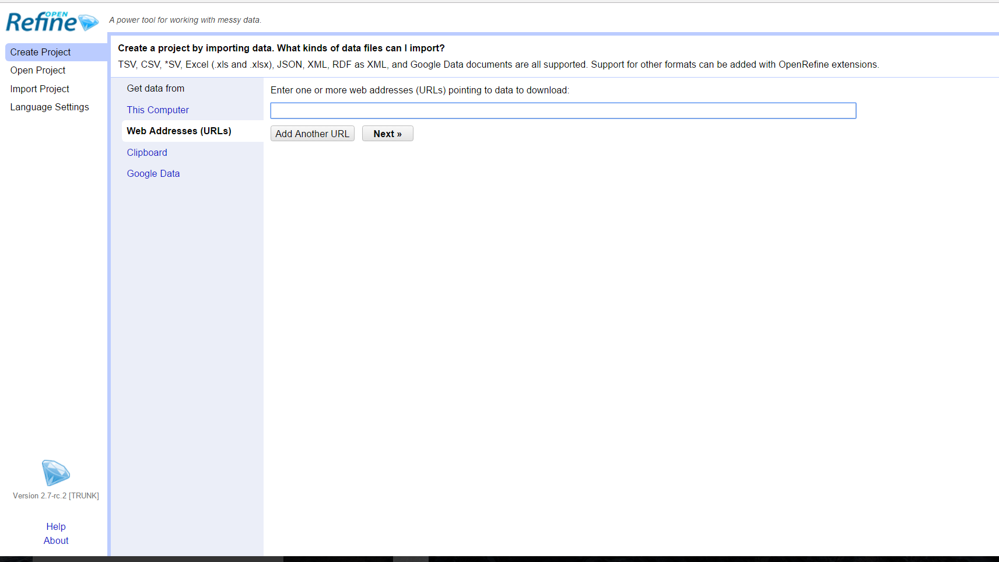
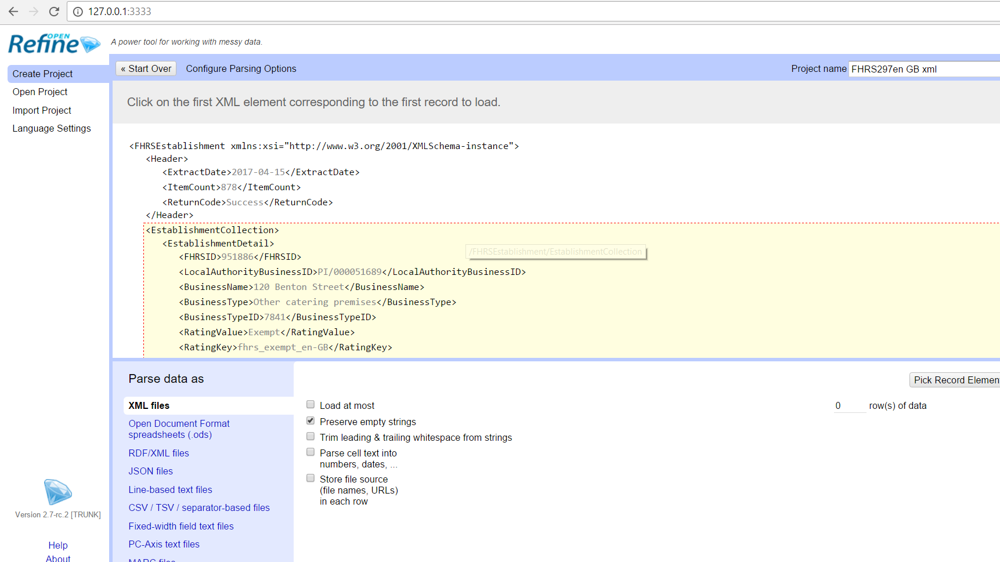

Importing: Uploading Spreadsheet
---------------------

1.  Open OpenRefine

    1.  The url <http://127.0.0.1:3333/> should lauch automatically in
        the default browser. If it doesn’t manually go to address

2.  Create Project

3.  Upload files

4.  Click **Next**

5.  Make sure fields are formatted correctly and then click **Create
    Project**

History: Undoing Changes
---------------

1.  Click on **Undo / Redo** tab (located on the left sidebar)

2.  Choose change you want to undo (the image below will show the under
    undoing adding .jpg to the filename column.

    

Filtering/Faceting: Normalizing values (i.e. USA and US)
---------------------------------------

1.  Click on Arrow of desired column (blue arrow)

2.  Choose **Facet &gt; Text Facet**

3.  In the right column all facets will appear

4.  Click on **Cluster** (red arrow)
    
    

5.  For **Keying Function** choose from dropdown based on results

6.  Change **New Cell Value** if necessary (green arrow)

7.  Check the boxes under the **Merge?** Column if you want the values
    in a cluster merged into one value (yellow arrow)

    

8.  Click on **Merge Selected & Re-Cluster** (**orange** arrow)

    1.  This will allow you to make sure no cells have been missed, the
        below image shows the results after the first cluster, a
        different **Keying Function** yielded more results

        

Filtering/Faceting: Normalizing Values which are not shown with the Cluster Method
-----------------------------------------------------------------

1.  If a like value is not being grouped correctly with **Cluster** rows
    can be manually changed to match

2.  In the right side column, find the facet to change.

3.  Click **edit**

4.  Change facet to correct value, **Apply.**

5.  All facets with that Value will be changed.

> The example below shows steps 3, 4 and 5. The Facet **Alejandro
> Fornes** was edited to be **Alejandro Rodriguez Fornes (Alucho).**
> Then applied. As the third picture shows, the facets have been
> combined (the number of rows with the facet increased from 4 to 7)

Filtering/Faceting: Creating Custom Text Facets
---------------------------

Openrefine allows for uses to create custom facets, using functions. The
functions allow users to view transformed facets. For example, if you
want to view only the first names of the autors in the image above, a
custom facet can be built to view. To see other expressions, go to
<https://github.com/OpenRefine/OpenRefine/wiki/Documentation-For-Users#reference>

1.  Click on column arrow

2.  Choose **Facet &gt; Custom text facet…**

3.  Enter the expression needed. (The example below splits at spaces,
    and chooses the first value)

4.  Click OK.

    

    

5.  The facets will allow the user to exclude or include facets

    

Filtering/Faceting: Searching through Facets
------------------------

Openrefine allows users to search through facets, an allows for multiple
facets to be searched at once.

1.  Click on arrow

2.  Choose **Text Filter**

3.  In sidebar type in search

4.  Repeat as many times as needed (see image 2)

> 
>
> 

Editing Cells: Transforming Cells
------------------

This section outlines how to mass edit one column. This example will add
the file extension to the filename.

1.  Click on the column arrow

2.  Choose **Edit cells &gt; Transform…**

3.  Enter expression to transform cell. Same expression documentation as
    **Creating Custom
    Text Facets.**<https://github.com/OpenRefine/OpenRefine/wiki/Documentation-For-Users#reference>

4.  Click **OK**

> 

Editing Cells: Split multi-valued Cells
------------------
This method splits cells at a specific given seperator (,:).  It will the values in the cells into their own row.

1. Click on column arrow

2. Choose **Edit cells > Split multi-valued cells…**

3. Enter the correct separator value (a , for this example)

4. Click Ok

Editing Cells: Join multi-valued Cells
------------------
This examples uses split cells from the previous example and rejoins the cells.

1. Click on column arrow

2. Choose **Edit cells > Join multi-valued cells…**

3. Choose the separator the values should be separated by (this example uses a ;)

4. Click OK

Editing Cells: Trim whitespace, change cells to lowercase, uppercase, etc.
-----------------------------------------------------------

There are a number of common transformation that openrefine offers its
user. They are shown in the image below.

1.  Click on column arrow

2.  Choose **Edit cells &gt; Common transforms &gt; \[Selected
    Transform\]**

    

Editing Columns: Copying and Transforming Columns
--------------------------------

This section allows for the section on **Transforming Cells** to be
performed by copying and transforming in another column, instead of
overwriting the original column.

1.  Choose **Edit column &gt; Add column based on this column…**

2.  Add **New column name**

3.  Add expression
    (<https://github.com/OpenRefine/OpenRefine/wiki/Documentation-For-Users#reference>)

4.  Click **OK**

    

    

Editing Cells: Fill Down
--------------------------------
This method allows for empty cells to be filled with the previously filled cell's value.

1. Choose column arrow

2. Choose **Edit cells > Fill down**

Reconcilination: Matching Cells to Controlled Vocabularies
-----------------------------------------

There are a number of vocabularies that can be reconciled against cells
including LCSH, VIAF and Wikipedia. These are the basic instructions.
Info reconcilable databases is found here:
<https://github.com/OpenRefine/OpenRefine/wiki/Reconcilable-Data-Sources>

**IMPORTANT NOTE:** A better **VIAF** matching service can be found
here: <http://refine.codefork.com/>

Matching url: **http://refine.codefork.com/reconcile/viaf**

**LCSH:** http://freeyourmetadata.org/reconciliation/

**Wikipedia** matching url:
<https://tools.wmflabs.org/openrefine-wikidata/en/api>

https://github.com/OpenRefine/OpenRefine/wiki/Reconciliation-Service-API

1.  For LCSH follow instructions on freeyourmetadata.org, for other
    services follow the following instructions

2.  In openrefine, choose column arrow

3.  Choose **Reconcile &gt; Start reconciling…**

    

4.  Click **Add Standard Service…** (blue arrow)

5.  Put matching url in box, this example uses VIAF’s
    [**http://refine.codefork.com/reconcile/viaf**](http://refine.codefork.com/reconcile/viaf)
    **(green** arrow)

6.  Click **Add Service** (purple arrow)

    

7.  Click **Start Reconciling**

    

8.  After the program has finished reconciling the program should look
    like the image below.

9.  Two things can happen: these topics can be matched to their cells or
    the best matches can be put into another column. This will show both

### Matching with cells.

1.  Click the check to match with the single cell, the double check will
    match to all identical cells (see image below)

2.  Matched cells will be shown in sidebar, additionally, the records are
    hyperlinks, so the information contained can be viewed.
    
    

### Adding matches to columns

1.  Click on Column arrow

2.  Chosoe **Edit column &gt; Add column based on this column…**

3.  Name the column

4.  Use the following documentation to choose
    <https://github.com/OpenRefine/OpenRefine/wiki/Variables>

5.  This example chooses the cell, grabs the best match, and chooses the
    name

6.  Click **OK**

    

Extension Installation 
-----------------------

Extension installation is covered in the first \_\_ steps.

1.  Download extension, this example downloads from here:
    http://software.freeyourmetadata.org/ner-extension/

2.  Go to openrefine home page

3.  Click **Open Project (blue arrow)**

4.  At the Bottom of the page click on **Browse Workplace directory
    (red arrow)**

5.  A file folder window should open

    

6.  If there is no folder named **extensions** create one

7.  Open the **extensions** folder

8.  Copy the downloaded extension into the folder

    1.  Make sure to unzip the file

1.  Restart openrefine

Named Entity Extraction
-----------------------

Named Entity Extraction will pull named entities (like names) from
description fields. Install instructions can be found here:
<http://freeyourmetadata.org/named-entity-extraction/> and below.

1.  Preform Extension Installation (seen above).  Download extension from: <http://software.freeyourmetadata.org/ner-extension/>

2. Once OpenRefine has been restarted, in the upper right hand corner under extensions: click on Named-entity recognition

3. Configure API services (note: some links are dead, new links below)
    Zemanta = <http://www.zemanta.com/?oppistid=aLSUtbXYbGt>
    dataTXT = <https://dandelion.eu/docs/api/datatxt/nex/getting-started/>

4. Click Update
    
5. Click on column arrow

6. Choose **Extract named entities...**

7. Click on proper API's.  DBpedia does not require an API key

8. **Start Extraction**
